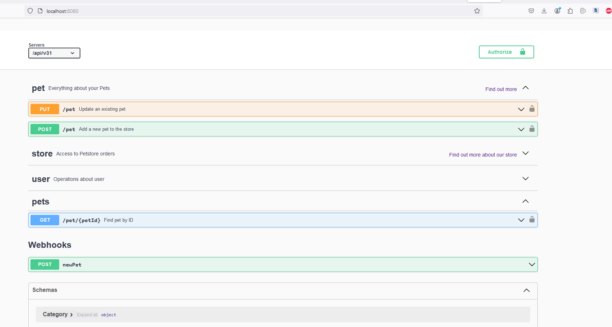

# Test Challenge - Erlyn Lebron 

 Sept 9th, 2024
 
This solution is made up of two parts: Test Automation and Test Performance challenges. 

### Note
This test challenge was prepared in a Windows environment. 

## Automation Test

For this part I've been assigned to select a list of test cases from the Swagger Petstore API to be automated.

### Requirements

My local environment was set like next: 
* IDE: IntelliJ IDEA 2022
* JDK: v17
* Maven: v3.6.3
* POM File: 
  * Dependencies: 
    * rest-assured v5.5.0
    * testng v7.10.2
    * json-simple v1.1.1
    * cucumber-java v7.18.1
    * cucumber-picocontainer v7.18.1
    * cucumber-testng v7.18.1
  * Plugins: 
    * maven-surefire-plugin v3.5.0
* IDE Plugins: 
  * Gherkin
  * Cucumber for Java

#### Important
As recommented by the instructions I tried to make this tests setting up the local server with Docker and Jetty but they failed. The Docker option worked partially when I switched to branch v31 but it only contained 3 endpoints as shown in image below. For that reason I decided to make the tests with the actual https://petstore.swagger.io/#/ source. 

### List of test cases 

This API has 3 parts: pets, store and users. I see all these endpoints useful but for the purpose of this test I'll just work with next list: 

#### Pets
* Adding a pet to the store
* Uploading a pet's image
* Updating a pet's info in the store
* Finding pets by status

#### Store 
* Get pets inventory
* Place order
* Find purchase by order ID

#### User
* Create one user
* Get user by name
* Update user
* Delete user

### Tests Execution

I mainly used Maven commands to run one or many scenarios filtering by tags, like next: 

* mvn verify -D"cucumber.filter.tags=@Smoke"
* mvn verify -D"cucumber.filter.tags=@FindPetsByStatus"

## Performance Test

#### Local Setup 

I used JMeter v5.4 which didn't work for me using Java 17 so I ran it using Java 8 by doing a temp change of Java Home in a command prompt as follows (JMeter Home was added to PATH environment variable): 

> set JAVA_HOME=C:\Program Files\Java\jdk1.8.0_251
> set PATH=%JAVA_HOME%/bin;%PATH%
> jmeter.bat
 
 JMeter file is located in *src/test/resources/PerformanceTests* and you can copy the images files it uses from *src/test/resources*
